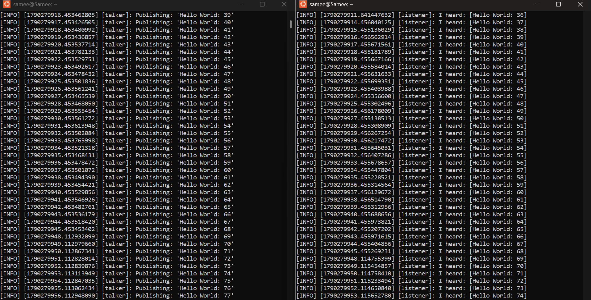
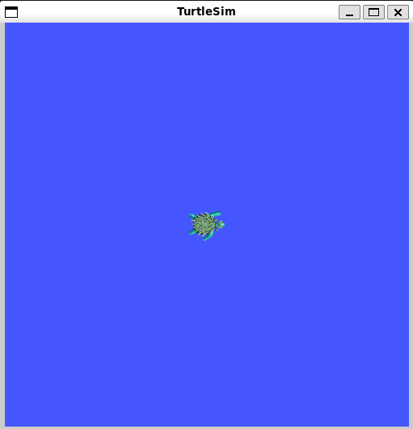
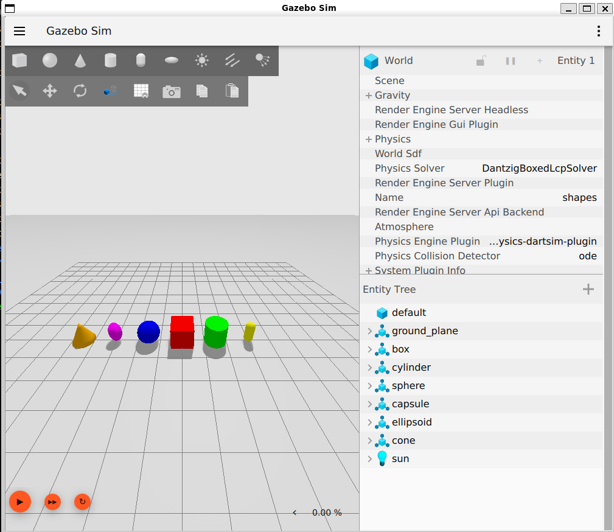

# HW1 Problem 2 — Getting to know ROS

Done individually on my own machine (Windows + WSL2 + Ubuntu 24.04).

| Part | Task | Where | Status |
|---|---|---|---|
| (a) | Install ROS 2 Jazzy + Gazebo Harmonic | [`a_install/`](a_install/) | ✅ Done — all three tests pass |
| (b) | Canvas quiz | Canvas | ⬜ |
| (c) | Char publisher + subscriber package, run + video | [`c_char_talk/`](c_char_talk/), code in [`../src/char_talk/`](../src/char_talk/) | ✅ Done |
| (d) | Publisher and subscriber on two computers (optional) | — | Not attempted |
| (e) | turtlesim at 45° with speed 2 from the command line + print pose | [`e_turtle_45deg/`](e_turtle_45deg/) | ✅ Done |
| (f) | Node that drives the turtle on a cosine wave | [`f_cosine_wave/`](f_cosine_wave/), code in [`../src/turtle_wave/`](../src/turtle_wave/) | ✅ Done |
| (g) | Setup log | [`g_setup_log/SETUP_LOG.md`](g_setup_log/SETUP_LOG.md) | ✅ Done |

## (a) Installation — evidence

| Test | Command | Result |
|---|---|---|
| A. Nodes communicate | `ros2 run demo_nodes_cpp talker` / `ros2 run demo_nodes_py listener` |  |
| B. turtlesim | `ros2 run turtlesim turtlesim_node` |  |
| C. Gazebo Harmonic | `gz sim shapes.sdf` |  |

_AI use: Used Claude for installation commands, build errors and ROS boilerplate code (permitted infrastructure use)._
