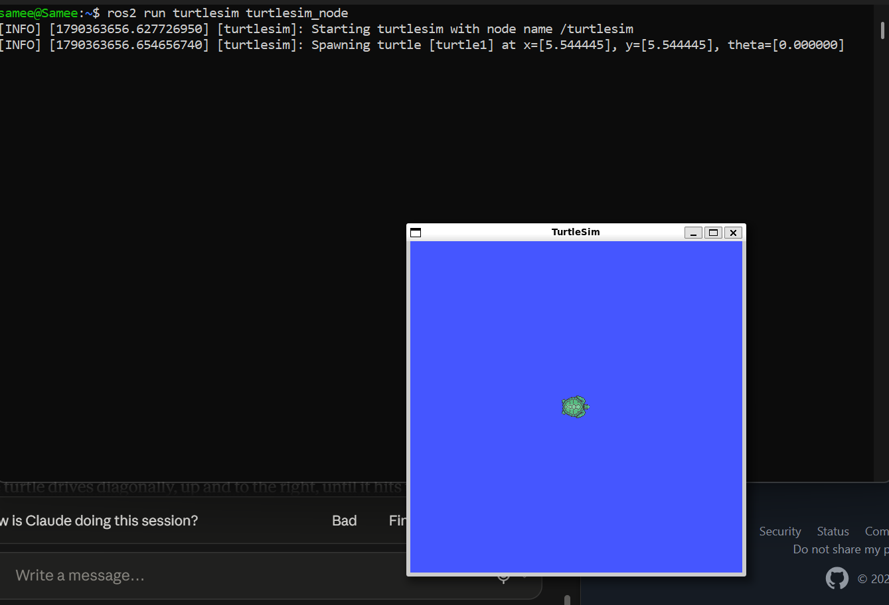
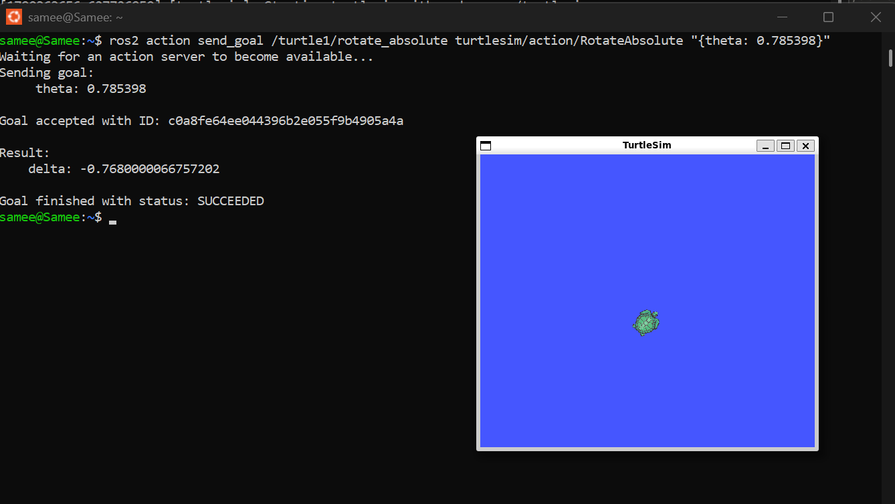
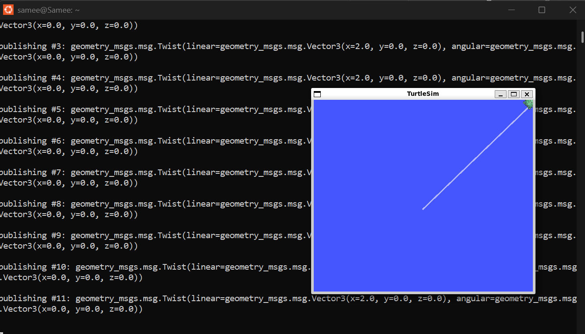
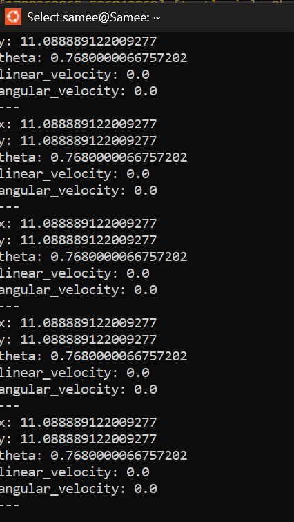

# (e) Move the turtle in a straight line at 45° with speed 2 — command line only

## Commands to move the turtle

```bash
# Terminal 1: start the simulator (turtle spawns at x = y = 5.544, theta = 0)
ros2 run turtlesim turtlesim_node

# Terminal 2: turn to face 45° using only cmd_vel: omega = pi/4 rad/s, applied by turtlesim for 1 s
ros2 topic pub --once /turtle1/cmd_vel geometry_msgs/msg/Twist "{linear: {x: 0.0, y: 0.0, z: 0.0}, angular: {x: 0.0, y: 0.0, z: 0.785398}}"

# (alternative used in the screenshots: turtlesim's rotate action)
ros2 action send_goal /turtle1/rotate_absolute turtlesim/action/RotateAbsolute "{theta: 0.785398}"

# Terminal 2: drive forward at 2 (units/s) in the turtle's own frame
ros2 topic pub --rate 1 /turtle1/cmd_vel geometry_msgs/msg/Twist "{linear: {x: 2.0, y: 0.0, z: 0.0}, angular: {x: 0.0, y: 0.0, z: 0.0}}"
```

## Commands to print the turtle's current location

```bash
ros2 topic echo /turtle1/pose          # continuous
ros2 topic echo /turtle1/pose --once   # single reading
```

## Why rotate first

`/turtle1/cmd_vel` sets the turtle's velocity in its own body frame: `linear.x` is forward along the direction it is facing, and because the turtle is a differential-drive robot it cannot move sideways. It spawns facing θ = 0, so publishing only `linear.x = 2` would drive it horizontally (ẋ = 2 cos 0 = 2, ẏ = 0). So I first turned it with an angular velocity, ω = π/4 rad/s for 1 s (θ̇ = ω, so θ changes by 45°), and then drove forward with `linear.x = 2` and ω = 0, so the heading stays at 45° and ẋ = ẏ = 2 cos 45° ≈ 1.41, which the equal x and y in the pose output confirms. Sending v and ω at the same time would not work: a constant turn rate while moving forward traces a circle of radius R = v/ω ≈ 2.5, not a straight line.

## Observed result

| Step | Screenshot |
|---|---|
| Spawn (theta = 0) |  |
| Rotate to 45° — goal SUCCEEDED |  |
| Drive forward at 2 — straight diagonal line to the corner |  |
| Pose echo |  |

- Final pose: x = y = 11.089 (the turtle moved equally in x and y, then stopped at the window edge; `linear_velocity: 0.0` there).
- Final heading: theta = 0.768 rad ≈ 44.0°, about 1° short of 45°, because `rotate_absolute` stops once it is within a small tolerance of the goal. For an exact heading, `ros2 service call /turtle1/teleport_absolute turtlesim/srv/TeleportAbsolute "{x: 5.544445, y: 5.544445, theta: 0.785398}"` sets theta directly.
- Speeds in turtlesim are in turtlesim units per second, not physical metres.

_AI use: Used Claude to look up turtlesim command syntax and to tidy the wording of my explanation._
