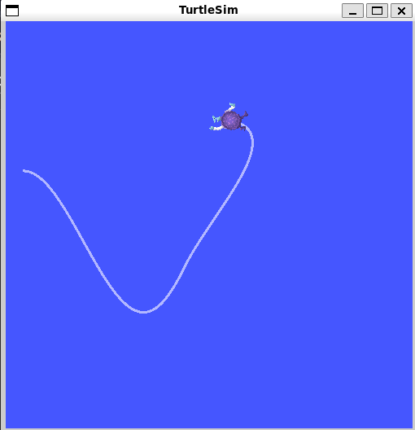
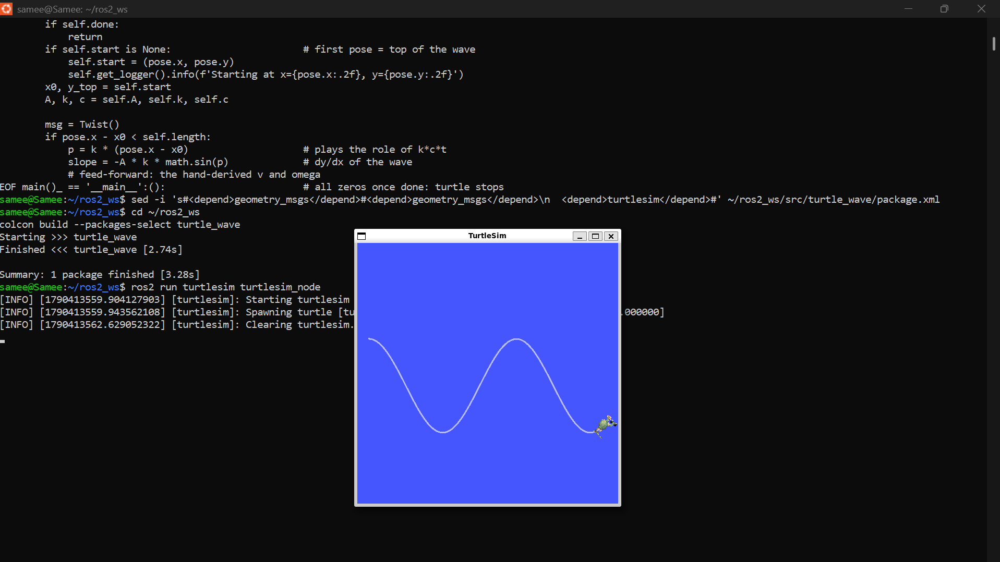

# (f) Cosine-wave turtle

Code: [`src/turtle_wave/turtle_wave/cosine_wave.py`](../../src/turtle_wave/turtle_wave/cosine_wave.py)

The turtle has differential-drive kinematics (as in video 7), so the node only sends
`linear.x` (forward speed v) and `angular.z` (turn rate ω) on `/turtle1/cmd_vel`.

## Derivation

Full LaTeX version: [`derivation_2f.tex`](derivation_2f.tex)

The turtle follows the unicycle model (differential drive), with only $v$ and $\omega$ as inputs:

$$\dot x = v\cos\theta,\qquad \dot y = v\sin\theta,\qquad \dot\theta = \omega$$

**Desired path** (steady progress to the right, cosine up and down; zero slope at $t=0$ matches the default heading $\theta=0$):

$$x(t) = c\,t,\qquad y(t) = A\cos(kct)$$

**Derivatives:**

$$\dot x = c,\quad \ddot x = 0,\quad \dot y = -Akc\sin(kct),\quad \ddot y = -Ak^2c^2\cos(kct)$$

**Forward speed** ($\dot x^2 + \dot y^2 = v^2$):

$$v(t) = \sqrt{\dot x^2+\dot y^2} = c\sqrt{1 + A^2k^2\sin^2(kct)}$$

**Turn rate** ($\tan\theta = \dot y/\dot x$, so $\theta = \arctan u$ with $u = \dot y / c$):

$$u = -Ak\sin(kct),\qquad \dot u = \frac{\ddot y}{c} = -Ak^2c\cos(kct)$$

$$\omega(t) = \frac{\dot u}{1+u^2} = \frac{-Ak^2c\cos(kct)}{1 + A^2k^2\sin^2(kct)}$$

**Checks:** at the top ($t=0$), $v=c$ and $\omega = -Ak^2c$ (hardest right turn; ICR $1/(Ak^2)$ to the right). On the steepest part ($kct=\pi/2$), $\omega = 0$ and $v = c\sqrt{1+A^2k^2}$ is largest.

Parameters used: A = 2, k = 1, c = 1. The turtle is first moved to the top of the wave:

```bash
ros2 run turtlesim turtlesim_node
ros2 service call /turtle1/teleport_absolute turtlesim/srv/TeleportAbsolute "{x: 0.5, y: 7.0, theta: 0.0}"
ros2 service call /clear std_srvs/srv/Empty
ros2 run turtle_wave cosine_wave
```

## Result 1: open loop (v, ω as functions of time only)



The first half-wave is correct, then the path drifts: the climb overshoots and curls left.
Nothing corrects small errors (missed or late commands, turtlesim lagging real time under WSL),
so the heading error accumulates, the same way encoder-only dead reckoning drifts.

## Result 2: same v, ω as feed-forward + correction from `/turtle1/pose`



The node subscribes to `/turtle1/pose` and evaluates the hand-derived v and ω at the turtle's
actual position (k·c·t replaced by k·(x − x₀)), plus a small correction
ω = ω_ff − K_θ·(θ − θ_des) − K_y·(y − y_des) with K_θ = 4, K_y = 2.
The turtle now traces a clean cosine (about 1.5 periods, y between 3 and 7).

_AI use: Claude used for the ROS node boilerplate, build steps, the pose-feedback correction, and typesetting my derivation in LaTeX._
